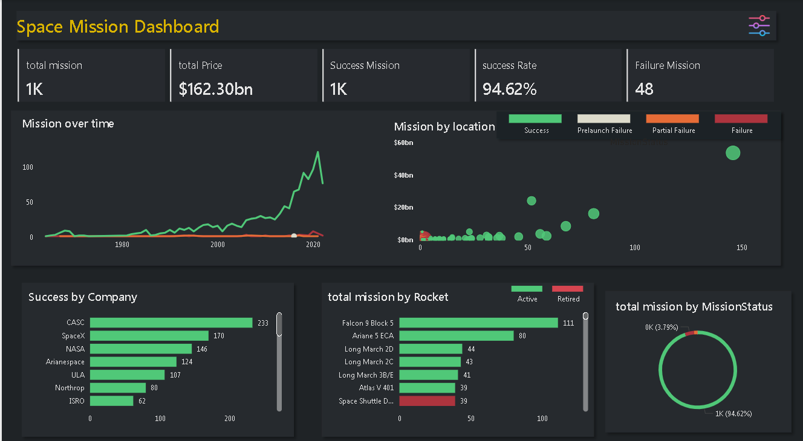

# space-mission-dashboard
# 🚀 Space Mission Dashboard – Power BI Project

This project is an interactive Power BI dashboard built using a dataset of over 1,000 space missions. It visualizes trends in global space missions, company performance, mission outcomes, and rocket activity over time.

---

## 📊 Key Insights

- 💰Total Spend: $162.30 billion+
- ✅ Overall Success Rate: 94.62%
- 🛰️Top Company by Success: CASC (China Aerospace Science and Technology Corporation) – 233 successful missions
- 📈 Mission Trends Over Time: Rapid growth post-2000, peaking around 2020
- 🚀*Most Active Rockets: Falcon 9 Block 5, Ariane 5 ECA
- 🌍 Launch breakdown by Location, Company, and Status

## 🛠️ Tools & Technologies Used

- Power BI
- DAX (Data Analysis Expressions)
- Power Query
- Data Modeling

## 📁 Dataset

- Source: [Kaggle - Space Missions Dataset](https://www.kaggle.com/datasets/alexanderbader/space-missions)
- Includes: Mission name, company, rocket, location, mission status, cost, and date

## 📷 Screenshots

Dashboard view showing:
- KPIs and success metrics
- Company-wise and location-wise filters
- Mission activity timeline

---

## 🧠 Skills Practiced

- Data cleaning and transformation
- Creating custom DAX measures
- Designing dashboards with interactivity and storytelling
- Data exploration and visualization

---

## 🔗 Connect With Me

💬 [LinkedIn](https://www.linkedin.com/in/sandipstha12)  
📫 Email: psth117@gmail.com

## 🔖 Tags

`Power BI` `DAX` `Dashboard Design` `Data Analytics` `Space Exploration` `Data Visualization`
